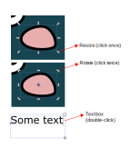
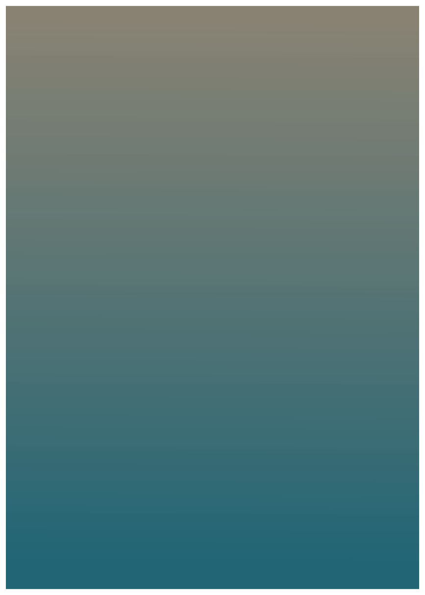
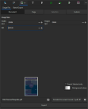

--- 
title: "Introduction to Vector Graphics<br>
         for Science-n-Stuff"
author: "Kat Assersohn"
date: "`r format(Sys.Date(), '%m-%Y')`"
output: 
  html_document:
    code_folding: show
    theme:
      bg: "#202123"
      fg: "#B8BCC2"
      primary: "#EA80FC"
      secondary: "#00DAC6"
      heading_font:
        google: Proza Libre
---
```{r setup, include=FALSE}
if (requireNamespace("thematic")) 
  thematic::thematic_rmd(font = "auto")
```
## What are vector graphics and why should I care?

Pixelated (bitmap) images are fantastic at conveying photorealism, but they are not always the best choice for displaying detailed and
consistent graphical information:

- **We cannot scale bitmap images without losing precision:**<br>
Bitmap images are made up of a fixed number of pixels, so they only look their best at a specific size and resolution and become
pixelated/blurry when resized (they can be made smaller, but not bigger).

- **Bitmaps are often large and resource-hungry:**<br>
Every pixel in a bitmap image is associated with a separate piece of memory in the computer. This means that detailed images can be very
large, difficult to edit and share, and their quality is dependent on the software and hardware used to view them. 

## So what's so special about vectors? 
- **Vectors are scalable with no loss of quality**<br>
Instead of containing a fixed number of square pixels, vector graphics store information about objects as points on a plane,
connected by mathematical equations that describe their shape and relationships to one another.

- **Files are much smaller**<br>
Vector graphics can be more easily edited, shared and stored than bitmap images.

- **The image always looks the same, on screen or printed, regardless of the size or resolution**
All this makes them a great choice for precise/detailed plots, schematics, infographics, graphical abstracts and posters.


##  {.tabset .tabset-fade}

### Bitmap image of a zebra finch
```{r, results='asis', echo=FALSE}
htmltools::tags$div(
  style = "display: flex; justify-content: space-around; margin-bottom: 20px;",  # Add margin below the div
  htmltools::tags$figure(
    htmltools::tags$img(src = "Images/ZF.jpg", 
                        alt = "Zebra Finch Male", 
                        style = "margin-top: 20px; margin-bottom: 20px;"),  # Add margin above and below the image
    htmltools::tags$figcaption("Bitmap image of a zebra finch")
  ),
  htmltools::tags$figure(
    htmltools::tags$img(src = "Images/PixelatedZF.jpg", 
                        alt = "Zebra Finch Male Zoomed", 
                        style = "margin-top: 20px; margin-bottom: 20px;"),  # Add margin above and below the image
    htmltools::tags$figcaption("scaled bitmap image of a zebra finch")
  )
)
```

### Vector drawing of a zebra finch
```{r, results='asis', echo=FALSE}
htmltools::tags$div(
  style = "display: flex; justify-content: space-around;",
  htmltools::tags$figure(
    htmltools::tags$img(src = "Images/zebrafinchmale.svg", 
                        alt = "Zebra Finch Male", 
                        style = "width: 50%; height: auto;"),
    htmltools::tags$figcaption("Vector drawing of a zebra finch")
  ),
  htmltools::tags$figure(
    htmltools::tags$img(src = "Images/zebrafinchmaleZOOM.svg", 
                        alt = "Zebra Finch Male Zoomed", 
                        style = "width: 90%; height: auto;"),
    htmltools::tags$figcaption("scaled vector drawing of a zebra finch")
  )
)
```

##### **What kind of things can I create with a vector graphics software?**

Almost any type of graphic you can imagine.. but most relevant to us as scientists:

- scientific drawings/diagrams and schematics
- Graphical abstracts
- Posters
- Graphics for plot illustration 
- Plot edits and annotations
- Accurate plot simplification (for science communication, teaching or presentations)
- etc...etc...

## What's the catch?

It requires a little bit of practice to get to grips with vector graphics software, but you don't need to be 
an artist or designer to make use of these tools. There are some considerations to keep in mind when using vector graphics:

#### **File types**<br> 
- Most commonly you'll see .svg (Scalable Vector Graphics). (Svg's are XML based which makes them easy to render in most web browsers for quick viewing!)
- PDFs can also be vector-based (but not always). Think about how when you zoom into a pdf file the text always remains crisp and clear!
- Another common file type is .eps (Encapsulated PostScript). .EPS in my experience is a favourite of journals because it's so easily editable and compatible with most design software. <br>

<div class="alert alert-info">
<strong>Tip!</strong> If you're working in Illustrator, files will be .ai natively, and if you're working in Inkscape it will be .svg. I recommend you always keep a copy of your file in the native format of the software it was created in, and save any exports as a new version, just incase something goes wrong down the line.
It's easy to export a .ai file into a .eps, but not necessarily the other way around... 
</div>

#### **Reproducibility**<br>
You can easily save plots from R as vectors that can then be edited in a vector graphics software. In RStudio you can use ggsave, in vscode you can save plots directly as svg files from the viewing pane. 

It's important to bear in mind though, that the more heavily manually edited a plot is, the less reproducible it is. Before editing a plot 
it's worth asking yourself whether a coding solution might be a better option first! 

#### **Colour models**<br>
The two main types of colour models are RGB (Red, Green, Blue) (used primarily for digital display) and CMYK (Cyan, Magenta, Yellow, Black) (used primarily
for print). It's important to consider the colours of your work **before** you start. Just remember that a graphic produced with RGB colours will look different when printed and visa versa.


<br>
Which to choose for both print and screen? There isn't an obvious answer but I usually
create the image in RGB first because of the wider choice of colours available for digital displays. 
Just remember that before printing, you might want to convert the image to CMYK to ensure accurate colour reproduction.

<div class="alert alert-info">
<strong>Note!</strong> While Illustrator has a built in engine for converting between colour models, in Inkscape it's a bit more tricky, and you might have to use a different
software - I think Scribus is the most commonly used free option.
</div>

#### **Which software should I use?**<br>

There are countless options! I've dabbled in a few but the two most popular are probably Inkscape and Illustrator. They both have their pros and cons and I've listed a few below:

| Inkscape    | Illustrator |
| ----------- | ----------- |
| Very accessible (free and open source) with community driven updates      | Requires a licences subscription with Adobe (free for UoS staff and students upon request, but expensive otherwise)   |
| .svg native format. May struggle with some complex file types   | .ai native format, more flexible at handling complex file types. Seamless workflow with other Adobe software     |
| RGB native colour model, external software needed for colour model conversion | RGB or CMYK colour models easily specified with a built in colour model conversion engine |
| Can have stability issues, but has fewer system requirements | Pretty stable, however can require a huge amount of RAM for big files and won't run well on old/certain systems |
| Lacks some tools and features, however realistically it has everything you need for simple graphics and posters | Has a lot of specialised tools and functions. The industry standard |
| Many community resources out there for learning, with a shallower learning curve than Illlustrator | Steeper learning curve, so not as suitable for beginners, fewer community resources |

## **Introduction to Inkscape**

Note this is not an exhaustive tutorial, but just a list of the most important tools and features I think you'll need to get started

#### Setting up document properties:

- Page format
- Page orientation
- Guides (create guides around page is handy)
- Metadata
- Licence (if needed)
- Resize to content (useful to remember this feature but don't worry about it for now)

#### Moving about:

- Zoom in and out either with the zoom tool (bottom right), or <kbd>ctrl + scroll</kbd>
- There are also some useful quick zoom tools in the commands bar on the right (e.g. zoom to page, zoom to selection, zoom centre view etc)
- Drag the page around the page by pressing the scroll wheel, holding the <kbd>spacebar</kbd>, or <kbd>ctrl/shift + right click</kbd>
- Rotate the page with the rotate tool (bottom right under the palette)

#### **The main interface:**

From the Inkscape manual

**Toolbox:** Tool selection

**Working page area:** You can use the canvas outside but it won't be rendered in the final export

**Docking area:** Dialogs for specific tool functions

**Commands bar:** Quick access to common commands

**Snap controls:** Useful for aligning objects but can be irritating. I recommend turning snapping off to start with

**Palette:** Basic usage for changing object fill (<kbd>shift + click</kbd> for stroke/outline). Change palette on the right

**Tool control bar:** More adjustable options for the selected tool

#### **Layers**

Future you will thank you for taking the time to organise objects into layers! 

You can <kbd>shift</kbd> to select multiple objects, then group them (<kbd>right click</kbd> + group) to move and adjust objects together, and gather them under the same layer controls. 


#### **Key tools**

<div style= "float:right;position: relative; top: +0px;">
 
</div>

There are currently around 23 primary tools in Inkscape, but you're not likely to use all of them (for now). Only a few are really necessary to get started. 
I'll show you the tools I've found most useful. 

- **Selector tool:** The primary tool you'll use to navigate your workspace, move, rotate, scale and select objects.
  
- **Node tool:** You'll use this to edit the shape of objects. I'll talk more about nodes below
  
- **Shape tools:** Quickly create rectangles, circles, stars and polygons. Use the tool control bar for more options
  
- **Pen tool:** You'll use this to draw precise lines and shapes by hand. It takes a little work to get the hang of, but once you do you'll find it the most versatile and useful tool at your disposal.
  
- **Text tool:** You can guess what this does. You can change the font, size, colour, alignment and more in the text dialog in the docking area.
  
- **Gradient tool:** This one you might not use as much, but it's a nice way to add some depth to your work. 
  
- **Dropper and bucket tools:** You've probably used these in Paint, they provide quick and easy ways to change the colour of objects
  
- **Connector tool:** This is possibly another slightly obscure tool, but it's useful for drawing straight lines, flow charts and diagrams

#### **Anatomy of an object**

##  {.tabset .tabset-fade}

### Adjusting object shapes with the node tool
```{r, results='asis', echo=FALSE}
htmltools::HTML('
<div class="tabset tabset-fade">
  <div class="tab-content">
    <div class="tab-pane active" id="tab1">
      <div style="display: flex; align-items: flex-start;">
        <figure>
          
        </figure>
        <div>
          <ul style="list-style-type: disc; padding-left: 20px;">
            <li style="margin-bottom: 10px;">In vector graphics, nodes are individual points on a path that defines its shape and can be manipulated through vector graphics software</li>
            <li style="margin-bottom: 10px;">Use the node tool to access the nodes of an object/path. </li>
            <li style="margin-bottom: 10px;">You can directly move the node to change the object\'s shape, or adjust the curvature using the node handles.</li>
            <li style="margin-bottom: 10px;">Double-click to add nodes, <kbd>delete</kbd> to remove them.</li>
            <li style="margin-bottom: 10px;">Join nodes with other nodes, or break node paths using the node tools in the tool control bar.</li>
            <li style="margin-bottom: 10px;">Adjust the shape of lines around nodes by using the corner or auto-smoothing tools in the tool control bar.</li>
          </ul>
        </div>
      </div>
    </div>
  </div>
</div>
')
```


### Moving and resizing objects
```{r, results='asis', echo=FALSE}
htmltools::HTML('
<div class="tabset tabset-fade">
  <div class="tab-content">
    <div class="tab-pane active" id="tab1">
      <div style="display: flex; align-items: flex-start;">
        <figure>
          
        </figure>
        <div>
          <ul style="list-style-type: disc; padding-left: 20px;">
            <li style="margin-bottom: 10px;">An object can be easily resized or rotated by clicking in the object bounding box, once for resizing, twice for rotation.</li>
            <li style="margin-bottom: 10px;">Press <kbd>ctrl</kbd> to keep the aspect ratio when resizing, and <kbd>shift</kbd> to rotate in 15 degree increments.</li>
            <li style="margin-bottom: 10px;">Double click to access the text box adjustments. This will appear red if the text goes outside the limits of the text box. </li>
            <li style="margin-bottom: 10px;">The text itself can also be edited in the text dialog in the docking area.</li>
          </ul>
        </div>
      </div>
    </div>
  </div>
</div>
')
```


### Adjust object properties
```{r, results='asis', echo=FALSE}
htmltools::HTML('
<div class="tabset tabset-fade">
  <div class="tab-content">
    <div class="tab-pane active" id="tab1">
      <div style="display: flex; align-items: flex-start;">
        <figure>
          
        </figure>
        <div>
          <ul style="list-style-type: disc; padding-left: 20px;">
            <li style="margin-bottom: 10px;"><kbd>ctrl + shift + F</kbd> to bring up the object fill and stroke options in the docking area.</li>
            <li style="margin-bottom: 10px;">Quickly change object fill using the colour palette bar at the bottom.</li>
            <li style="margin-bottom: 10px;">Quickly change object stroke using the colour palette bar at the bottom using <kbd>shift</kbd> when selecting.</li>
            <li style="margin-bottom: 10px;">Remove outline or fill entirely by clicking the X bottom left of the palette (or in fill/stroke options in the docking area).</li>
          </ul>
        </div>
      </div>
    </div>
  </div>
</div>
')
```

## 

<div class="alert alert-info">
<strong>Tip!</strong> Each node on a path needs to be calculated and rendered by the software. The more nodes your shape has, the more complex it becomes and the heavier the load on your system. 
Past a certain point this can create significant lag (particularly in Inkscape), so it's best to keep your shapes as simple as possible. The simplify tool can automatically reduce the number of nodes in an overly complex object. 
Try this using <kbd>ctrl + L</kbd> on a selected object and see how it responds. You can also manually remove excess nodes. Learning how to use the pen tool properly is a great way to minimise excessive node use (more on this later).
</div>

## **Let's make a basic poster template!**

##  {.tabset .tabset-fade}


### 1. Set up a new document

```{r, results='asis', echo=FALSE}
htmltools::HTML('
<div class="tabset tabset-fade">
  <div class="tab-content">
    <div class="tab-pane active" id="tab1">
      <div style="display: flex; align-items: flex-start;">
        <figure>
          
        </figure>
        <div>
          <ul style="list-style-type: disc; padding-left: 20px;">
            <li style="margin-bottom: 10px;">File > Document Properties</li>
            <li style="margin-bottom: 10px;">Under the <kbd>Display</kbd> tab, Set the page size.</li>
            <li style="margin-bottom: 10px;">Under the <kbd>Display</kbd> tab, set the page orientation.</li>
            <li style="margin-bottom: 10px;">Under the <kbd>Guides</kbd> tab, you can create some guides around the page if you like (not essential). You can add new guides easily using the ruler later if needed.</li>
            <li style="margin-bottom: 10px;">Under the <kbd>Metadata</kbd> tab, add some deets (I would probably at least add your name and the date).</li>
            <li style="margin-bottom: 10px;">Under the <kbd>Licence</kbd> tab, you can add a licence if you want to share your work.</li>
          </ul>
        </div>
      </div>
    </div>
  </div>
</div>
')
```

### 2. create a background

```{r, results='asis', echo=FALSE}
htmltools::HTML('
<div class="tabset tabset-fade">
  <div class="tab-content">
    <div class="tab-pane active" id="tab1">
      <div style="display: flex; align-items: flex-start;">
        <figure>
          
        </figure>
        <div>
          <ul style="list-style-type: disc; padding-left: 20px;">
            <li style="margin-bottom: 10px;">Add a new layer (numerous ways, easiest is just Layer > Add Layer, or through the Layers and Objects tab in the docking area), give it a name.</li>
            <li style="margin-bottom: 10px;">Enable snapping, and create a background using the rectangle tool, drag it to fill the page and make it whatever colour you like (I\'m sure you\'ll change this later).</li>
            <li style="margin-bottom: 10px;">This is a good time to check your colour model is set to CMYK (for print!), Do this in the Fill and Stroke tab in the docking area.</li>
            <li style="margin-bottom: 10px;">Lock the layer (click the padlock icon) so you don\'t accidentally move it.</li>
            <li style="margin-bottom: 10px;">If you want to be fancy, you can give your background a gradient, just give each point on the gradient line a different colour, and play around with the gradient options in the docking area</li>
          </ul>
        </div>
      </div>
    </div>
  </div>
</div>
')
```

### 3. Add some text and figure boxes

```{r, results='asis', echo=FALSE}
htmltools::HTML('
<div class="tabset tabset-fade">
  <div class="tab-content">
    <div class="tab-pane active" id="tab1">
      <div style="display: flex; align-items: flex-start;">
        <figure>
          
        </figure>
        <div>
          <ul style="list-style-type: disc; padding-left: 20px;">
            <li style="margin-bottom: 10px;">Add a new layer for text and figure boxes, make sure this new layer sits \'above current\'.</li>
            <li style="margin-bottom: 10px;">Disable snapping and add some boxes using the shape tool. kbd>ctrl + D</kbd> to duplicate any shapes you like.</li>
            <li style="margin-bottom: 10px;">Mess about with Align and Distribute in the docking area, which can help you position your boxes evenly.</li>
            <li style="margin-bottom: 10px;">Tip: You can round shape edges by pulling the circular node on the top right corner. </li>
            <li style="margin-bottom: 10px;">Tip: You can muck about with \'Path\' options by selecting two shapes with <kbd>shift</kbd>, and combining them (Union), using one shape to cut a hole out of another (Difference), or the opposite (Intersection). I\'ve illustrated an example here where I\'ve used the \'Difference\' option to cut shapes evenly to create a circular focal space.</li>
            <li style="margin-bottom: 10px;">Tip: There are loads of filter options for shapes. I have illustrated the use of drop shadows here. See the \'Filters\' tab in the menu bar.</li>
          </ul>
        </div>
      </div>
    </div>
  </div>
</div>
')
```

### 4. Add some text boxes

```{r, results='asis', echo=FALSE}
htmltools::HTML('
<div class="tabset tabset-fade">
  <div class="tab-content">
    <div class="tab-pane active" id="tab1">
      <div style="display: flex; align-items: flex-start;">
        <figure>
          
        </figure>
        <div>
          <ul style="list-style-type: disc; padding-left: 20px;">
            <li style="margin-bottom: 10px;">Create a text box using the text tool, and find the text tab in the docking area.</li>
            <li style="margin-bottom: 10px;">Type some text, adjust the font and size. You can also set it as default to keep it consistent across the document.</li>
            <li style="margin-bottom: 10px;">If you notice your text looks a bit clumpy, it might have a stroke effect on it, try removing that in Object Stroke and Fill, or in the palette (<kbd>shift</kbd> click on the X).</li>
          </ul>
        </div>
      </div>
    </div>
  </div>
</div>
')
```

### 5. Save the template and practice exporting

```{r, results='asis', echo=FALSE}
htmltools::HTML('
<div class="tabset tabset-fade">
  <div class="tab-content">
    <div class="tab-pane active" id="tab1">
      <div style="display: flex; align-items: flex-start;">
        <figure>
          
        </figure>
        <div>
          <ul style="list-style-type: disc; padding-left: 20px;">
            <li style="margin-bottom: 10px;">File >Save template (add some informative information here). I also recommend keeping an svg copy because the template will only be available on your local computer.</li>
            <li style="margin-bottom: 10px;">File >Export (or find this tab in the docking area).</li>
            <li style="margin-bottom: 10px;">Choose Document for now (you can mess about with exporting only selected objects later).</li>
            <li style="margin-bottom: 10px;">Choose document type and rasterisation (e.g. a 300 or 600 dpi pdf)</li>
            <li style="margin-bottom: 10px;">Ta da! You have a cute little poster template :D </li>
            <li style="margin-bottom: 10px;">Next time you want to make a poster, you can select File > New Document From Template > Custom and select your template from the list.</li>
          </ul>
        </div>
      </div>
    </div>
  </div>
</div>
')
```
  
##
<div class="alert alert-info">
<strong>Tip!</strong>Like the settings you applied to one object (or text box) and want to apply it to other objects? Select the object and <kbd>ctrl + C</kbd> it, 
then select the object you want to apply the settings to and <kbd>ctrl + shift + V</kbd>. This will apply the shapes colour, stroke and other attributes to the new object.
</div>

## **Become a pen tool pro**

##  {.tabset .tabset-fade}

## **Notes on exporting your work**

The compositor for the journal will convert your image to journal specifications accordingly, but it's best to send them the best quality images you can. Generally, 600DPI (DPI = dots per inch) is the standard for print, and 300DPI is the standard for web.
You can't go wrong saving your work at 600DPI.. but it's worth checking journal requirement first. 

There is sometimes a width and height limit for your work as well, best to check this when setting up document properties but it's generally easy to rescale your work down the line if you need to.

Journals prefer .eps files for final submission, but first submissions usually have more relaxed preferences - again, check journal specifications. And for your own sanity **save a copy of your work in the native format**. 
